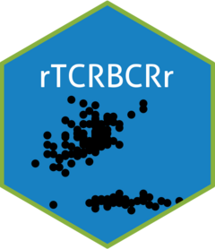

<!-- README.md is generated from README.Rmd. Please edit that file -->

[](https://github.com/sciencepeak/rTCRBCRr/actions/workflows/r_github_actions_01.yml)

# rTCRBCRr 

The goal of rTCRBCRr is to process the results from clonotyping tools
such as trust, mixcr, and immunoseq to analyze the clonotype repertoire
metrics

## Installation

You can **NOT** install the released version of rTCRBCRr from
[CRAN](https://CRAN.R-project.org) with:

``` r
install.packages("rTCRBCRr")
```

You can **ONLY** install the development version from
[GitHub](https://github.com/) with:

``` r
# install.packages("devtools")
devtools::install_github("sciencepeak/rTCRBCRr")
```

The goal of rTCRBCRr is to process the results from clonotyping tools
such as trust, mixcr, and immunoseq to analyze the clonotype repertoire
metrics

## Installation

You can **NOT** install the released version of rTCRBCRr from
[CRAN](https://CRAN.R-project.org) with:

``` r
install.packages("rTCRBCRr")
```

You can **ONLY** install the development version from
[GitHub](https://github.com/) with:

``` r
# install.packages("devtools")
devtools::install_github("sciencepeak/rTCRBCRr")
```

## Example code

### Attach packages

``` r
library("rTCRBCRr")
library("magrittr")
library("readr")
```

### Read raw data files (trust generated for example) into a list of data frames

``` r
input_paths <- dir(system.file("extdata", package = "rTCRBCRr"), full.names = TRUE)
input_files <- dir(system.file("extdata", package = "rTCRBCRr"), full.names = FALSE)
input_files
#> [1] "sample_01_report.tsv.bz2" "sample_02_report.tsv.bz2"
#> [3] "sample_03_report.tsv.bz2"
sample_names <- sub("_report.tsv.*", "", input_files)
sample_names
#> [1] "sample_01" "sample_02" "sample_03"
raw_clonotype_dataframe_list <- lapply(input_paths, readr::read_tsv) %>%
    magrittr::set_names(., value = sample_names)
raw_clonotype_dataframe_list
#> $sample_01
#> # A tibble: 622 x 9
#>    `#count` frequency CDR3nt           CDR3aa     V      D     J     C     cid  
#>       <dbl>     <dbl> <chr>            <chr>      <chr>  <chr> <chr> <chr> <chr>
#>  1      377    0.113  TGTCTACAGCATAAT~ CLQHNTHPY~ IGKV1~ .     IGKJ~ IGKC  asse~
#>  2      297    0.0889 TGCATGCAACGTATA~ CMQRIEFPS~ IGKV2~ .     .     .     asse~
#>  3      277    0.0829 TGCATGCAAGCTCTA~ CMQALQTPR~ IGKV2~ .     IGKJ~ IGKC  asse~
#>  4      230    0.0688 TGTCAACAGCTTAAT~ CQQLNSYRTF IGKV1~ .     IGKJ~ IGKC  asse~
#>  5      209    0.0625 TGTCAACAGCTTAAT~ CQQLNSYPR~ IGKV1~ .     IGKJ~ IGKC  asse~
#>  6      108    0.0323 TGCCAACAGTATAAT~ out_of_fr~ IGKV1~ .     IGKJ~ IGKC  asse~
#>  7      107    0.0320 TGCTGCTCATATGCA~ CCSYAGSYT~ IGLV2~ .     IGLJ~ IGLC  asse~
#>  8       86    0.0257 TGTCAGGCGTGGGAC~ CQAWDSSTY~ IGLV3~ .     IGLJ~ IGLC  asse~
#>  9       83    0.0911 TGTGGGAATAACAAT~ CGNNNARLMF TRAV1~ .     TRAJ~ .     asse~
#> 10       68    0.0738 TGTTGAGCAAATCAT~ C_ANHSVSS~ TRAV2~ .     TRAJ~ .     asse~
#> # ... with 612 more rows
#> 
#> $sample_02
#> # A tibble: 860 x 9
#>    `#count` frequency CDR3nt           CDR3aa     V      D     J     C     cid  
#>       <dbl>     <dbl> <chr>            <chr>      <chr>  <chr> <chr> <chr> <chr>
#>  1      346    0.0869 TGCATGCAACGTATA~ CMQRIEFPS~ IGKV2~ .     .     .     asse~
#>  2      279    0.0700 TGTCTACAGCATAAT~ CLQHNSYPW~ IGKV1~ .     IGKJ~ IGKC  asse~
#>  3      181    0.0455 TGTCAACAGGCTAAC~ CQQANSFPI~ IGKV1~ .     IGKJ~ IGKC  asse~
#>  4      112    0.0282 TGCATGCAAGCTCTA~ CMQALQTPW~ IGKV2~ .     IGKJ~ IGKC  asse~
#>  5       79    0.711  TGTGCCACCTGGGAC~ out_of_fr~ TRGV3~ .     TRGJ~ TRGC  asse~
#>  6       76    0.150  TGTTGAGCAAATCAT~ C_ANHSVSS~ TRAV2~ .     TRAJ~ .     asse~
#>  7       67    0.0169 TGTCAGCAGTATGGT~ CQQYGNSLL~ IGKV3~ .     IGKJ~ IGKC  asse~
#>  8       63    0.124  TGTGACAATAACAAT~ CDNNNDMRF  TRAV1~ .     TRAJ~ .     asse~
#>  9       61    0.0153 TGCCAACAGTATAAT~ CQQYNSYSP~ IGKV1~ .     IGKJ~ IGKC  asse~
#> 10       58    0.0146 TGCATGCAAGGTACA~ CMQGTHVWTF IGKV2~ .     IGKJ~ IGKC  asse~
#> # ... with 850 more rows
#> 
#> $sample_03
#> # A tibble: 975 x 9
#>    `#count` frequency CDR3nt          CDR3aa     V      D      J     C     cid  
#>       <dbl>     <dbl> <chr>           <chr>      <chr>  <chr>  <chr> <chr> <chr>
#>  1      300    0.454  TGCAGTGCTAGAGG~ CSARGAGEI~ TRBV2~ TRBD2~ TRBJ~ TRBC  asse~
#>  2       87    0.0207 TGCATGCAACGTAT~ CMQRIEFPS~ IGKV2~ .      .     IGKC  asse~
#>  3       81    0.0192 TGTCAGGCTTGGGA~ CQAWDNNAV~ IGLV3~ .      IGLJ~ IGLC  asse~
#>  4       78    0.0185 TGTGCAGCATGGGA~ out_of_fr~ IGLV1~ .      IGLJ~ IGLC  asse~
#>  5       71    0.0169 TGCAGCTCATATAC~ CSSYTSSSI~ IGLV2~ .      IGLJ~ IGLC  asse~
#>  6       70    0.0169 TGTCAAAAGTATAA~ CQKYNSAPF~ IGKV1~ .      IGKJ~ IGKC  asse~
#>  7       60    0.0143 TGTCAGCAGTATAA~ CQQYNQWPL~ IGKV3~ .      IGKJ~ IGKC  asse~
#>  8       59    0.0854 TGTTGAGCAAATCA~ C_ANHSVSS~ TRAV2~ .      TRAJ~ .     asse~
#>  9       57    0.0138 TGTCAGCAGTATGG~ CQQYGSSPP~ IGKV3~ .      IGKJ~ IGKC  asse~
#> 10       54    0.0128 TGTCAACAGTATTA~ CQQYYSYPP~ IGKV1~ .      IGKJ~ IGKC  asse~
#> # ... with 965 more rows
```

### Tidy up the clonotype dataframes

The tidy-up consists of four steps, namely four functions:

1.  format_clonotype_to_immunarch_style
2.  remove_nonproductive_CDR3aa
3.  annotate_chain_name_and_cell_type
4.  merge_convergent_clonotype

#### Calculate and merge repertoire metrics for each sample in the list

This step consists of two functions.

1.  compute_repertoire_metrics_by_chain_name
2.  combine_all_sample_repertoire_metrics

``` r
divergent_clonotype_dataframe_list <- raw_clonotype_dataframe_list %>%
    lapply(., format_clonotype_to_immunarch_style, clonotyping_tool = "trust") %>%
    lapply(., remove_nonproductive_CDR3aa) %>%
    lapply(., annotate_chain_name_and_cell_type) %>%
    lapply(., merge_convergent_clonotype)

all_sample_all_chain_all_metrics_wide_dataframe <- divergent_clonotype_dataframe_list %>%
    lapply(., compute_repertoire_metrics_by_chain_name) %>%
    combine_all_sample_repertoire_metrics

all_sample_all_chain_all_metrics_wide_dataframe
#>    sample_name chain_name diversity  clonality richness  evenness
#> 1    sample_01        IGH 3.8128541 0.15879308       93 0.8412069
#> 2    sample_01        IGK 3.5326955 0.27307986      129 0.7269201
#> 3    sample_01        IGL 3.2411554 0.19481434       56 0.8051857
#> 4    sample_01        TRA 4.5561670 0.09190495      151 0.9080950
#> 5    sample_01        TRB 4.1703127 0.10574307      106 0.8942569
#> 6    sample_01        TRG 0.6365142 0.08170417        2 0.9182958
#> 7    sample_02        IGH 4.6276182 0.08126629      154 0.9187337
#> 8    sample_02        IGK 4.6461374 0.17854595      286 0.8214540
#> 9    sample_02        IGL 4.2727276 0.11939386      128 0.8806061
#> 10   sample_02        TRA 3.9140472 0.15371455      102 0.8462854
#> 11   sample_02        TRB 3.6792926 0.07329419       53 0.9267058
#> 12   sample_02        TRD 0.6365142 0.08170417        2 0.9182958
#> 13   sample_02        TRG 1.3579779 0.15624092        5 0.8437591
#> 14   sample_03        IGH 4.5699705 0.06694162      134 0.9330584
#> 15   sample_03        IGK 4.9256343 0.10661142      248 0.8933886
#> 16   sample_03        IGL 4.7837763 0.10293857      207 0.8970614
#> 17   sample_03        TRA 4.2283160 0.10887746      115 0.8911225
#> 18   sample_03        TRB 2.8253024 0.40008828      111 0.5999117
#> 19   sample_03        TRD 1.3138644 0.05224719        4 0.9477528
#> 20   sample_03        TRG 2.0972999 0.18232308       13 0.8176769
```

### Separate the all_sample_all_chain_all_metrics_wide_dataframe by individual metrics.

``` r
individual_metrics_dataframe_list <- all_sample_all_chain_all_metrics_wide_dataframe %>%
    get_chain_name_x_sample_name_for_each_metric

individual_metrics_dataframe_list
#> $diversity
#>     sample_01 sample_02 sample_03
#> IGH 3.8128541 4.6276182  4.569970
#> IGK 3.5326955 4.6461374  4.925634
#> IGL 3.2411554 4.2727276  4.783776
#> TRA 4.5561670 3.9140472  4.228316
#> TRB 4.1703127 3.6792926  2.825302
#> TRG 0.6365142 1.3579779  2.097300
#> TRD        NA 0.6365142  1.313864
#> 
#> $clonality
#>      sample_01  sample_02  sample_03
#> IGH 0.15879308 0.08126629 0.06694162
#> IGK 0.27307986 0.17854595 0.10661142
#> IGL 0.19481434 0.11939386 0.10293857
#> TRA 0.09190495 0.15371455 0.10887746
#> TRB 0.10574307 0.07329419 0.40008828
#> TRG 0.08170417 0.15624092 0.18232308
#> TRD         NA 0.08170417 0.05224719
#> 
#> $richness
#>     sample_01 sample_02 sample_03
#> IGH        93       154       134
#> IGK       129       286       248
#> IGL        56       128       207
#> TRA       151       102       115
#> TRB       106        53       111
#> TRG         2         5        13
#> TRD        NA         2         4
#> 
#> $evenness
#>     sample_01 sample_02 sample_03
#> IGH 0.8412069 0.9187337 0.9330584
#> IGK 0.7269201 0.8214540 0.8933886
#> IGL 0.8051857 0.8806061 0.8970614
#> TRA 0.9080950 0.8462854 0.8911225
#> TRB 0.8942569 0.9267058 0.5999117
#> TRG 0.9182958 0.8437591 0.8176769
#> TRD        NA 0.9182958 0.9477528
```

## Clonotype repertoire metrics formulas

The repertoire metrics formula including richness, diversity (Shannon
entropy), evenness (Pielou’s eveness), and clonality were defined as
follows, where  is
the frequency of

in a sample with  unique
clonotypes ([Khunger, Rytlewski et
al. 2019](https://doi.org/10.1080/2162402X.2019.1652538), [Looney,
Topacio-Hall et al. 2020](https://doi.org/10.3389/fimmu.2019.02985)).


}}
")


The internal function `calculate_repertoire_metrics` is essential to
implement the repertoire metrics formulas

``` r
calculate_repertoire_metrics
#> function (named_species_vector) 
#> {
#>     stopifnot(!duplicated(names(named_species_vector)))
#>     species_vector <- named_species_vector
#>     frequency_vector <- species_vector/sum(species_vector)
#>     shannon_entropy <- -sum(frequency_vector * log(frequency_vector), 
#>         na.rm = TRUE)
#>     richness_count <- length(species_vector)
#>     pielou_evenness <- shannon_entropy/log(richness_count)
#>     clonality_score <- 1 - pielou_evenness
#>     output_vector <- c(shannon_entropy, clonality_score, richness_count, 
#>         pielou_evenness)
#>     names(output_vector) <- c("diversity", "clonality", "richness", 
#>         "evenness")
#>     output_vector
#> }
#> <bytecode: 0x0000000020ba4cd0>
#> <environment: namespace:rTCRBCRr>
```

## Acknowledgements

The [hexagon](https://github.com/terinjokes/StickersStandard) logo of
the package was created with the help of the package
[hexSticker](https://github.com/GuangchuangYu/hexSticker). The math
formula was written with the help of recognition tool
[MyScript](https://webdemo.myscript.com/). The latex formula in markdown
was inspired by [rmd4sci](https://rmd4sci.njtierney.com/math). The code
in this study was inspired by the [UCSB R tutorial
note](http://traits-dgs.nceas.ucsb.edu/workspace/r/r-tutorial-for-measuring-species-diversity/Measuring%20Diversity%20in%20R.pdf/attachment_download/file),
[LymphoSeq script](https://rdrr.io/bioc/LymphoSeq/src/R/clonality.R),
and [vegan
package](https://cran.r-project.org/web/packages/vegan/vignettes/diversity-vegan.pdf).
